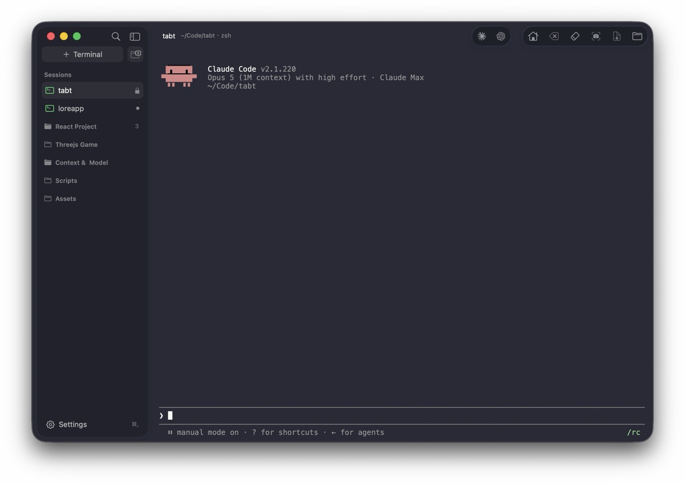

# TabT

A small, fast native terminal emulator for macOS, written in Rust on top of AppKit. Multi-tab
sessions with a self-drawn sidebar for tabs and groups, and a dependency-free VT/ANSI core.





## Features

1. **Multi-tab sessions** — one PTY per tab, listed under "Sessions" in the sidebar; ⌘T for a new one.
2. **Groups** — organize tabs into named, collapsible groups; drag to reorder tabs and groups.
3. **Search & rename** — ⌘F filters the list; double-click a tab/group to rename in place.
4. **Color themes** — 12 built-in schemes, six dark (Tokyo Night, Catppuccin Mocha, Dracula, Nord,
   Gruvbox Dark, Solarized Dark) and six light (Catppuccin Latte, Rosé Pine Dawn, Gruvbox Light,
   Solarized Light, GitHub Light, Ayu Light); the whole UI derives from the active theme, staying
   legible on light and dark alike. They are plain data, not code: edit `~/.tabt/themes.conf` to
   change one or add your own.
5. **Fonts** — 9 classic monospace families, adjustable live with ⌘= / ⌘- / ⌘0.
6. **Settings dialog** (⌘,) — five panes, everything applied live and saved at once: *Theme*
   (a grid of preview cards, each a miniature of the app in that theme rather than a name in a
   list), *Appearance* (font, size, sidebar side, border, padding, background opacity), *Toolbar*
   (below), *Terminal* (cursor shape, blink, scrollback depth) and *Shell* (which shell to run, and
   whether a new tab opens in your home directory or the active tab's).
7. **A toolbar you arrange by dragging it** — the title bar carries two groups of buttons: the AI
   launchers (Claude and Codex out of the box; Gemini, Aider and Cursor waiting in the palette),
   which type their command into the session and press Return, and actions on the session in front
   of you — home, clear line, clear, screenshot, export text, reveal in Finder, and more. The
   *Toolbar* settings pane is the toolbar itself, drawn at full size: drag a button to reorder it,
   or out of its row to put it away.
8. **Live session state** — each row's icon shows whether that session is running a job, sitting at
   a prompt, or has exited, and a background tab is marked when it prints something you haven't seen
   or rings the bell. Click a session's icon to give it a color of your own.
9. **Persistence** — layout, groups, tabs, theme, font, and window position and size are restored on
   launch.
10. **Mouse support in TUIs** — clicks, drags and the wheel are reported to the running application
   (vim, tmux, htop, lazygit), in both the legacy and the SGR encoding; hold ⇧ to select text
   instead.
11. **VT/ANSI core** — SGR colors and text attributes, cursor/scroll/erase operations, alternate
    screen buffer, DEC private modes and IRM, tab stops, the DEC line-drawing charset, DSR/DA,
    OSC title and cwd reporting, UTF-8.

## Install

Download `TabT-<version>.dmg` from the [latest release](https://github.com/hex2null/TabT/releases/latest)
and drag TabT to Applications. macOS 12 or later.

The released image is **not** signed with a Developer ID or notarized, so Gatekeeper will refuse to
open it on first launch. Right-click the app and choose *Open* (or run
`xattr -dr com.apple.quarantine /Applications/TabT.app`) to get past that once. Building it yourself,
below, avoids the question entirely.

## Build & run

Requires macOS and a Rust toolchain (`rustup.rs`).

```sh
git clone https://github.com/hex2null/TabT.git tabt && cd tabt
make run
```

This builds a release binary, bundles it into `dist/TabT Dev.app`, code-signs it, and launches it.
`make release` produces the shipping identity, `dist/TabT.app`.

## Keyboard shortcuts

| Shortcut | Action | | Shortcut | Action |
|---|---|---|---|---|
| ⌘T | New terminal | | ⌘F | Search sessions |
| ⇧⌘N | New group | | ⌘B | Toggle sidebar |
| ⌘W | Close tab | | ⌘K | Clear screen |
| ⌘R | Rename session | | ⌘= / ⌘- / ⌘0 | Font size ± / reset |
| ⌘, | Settings | | ⌘C / ⌘V / ⌘A | Copy / paste / select all |
| ⇧⌘R | Reveal cwd in Finder | | ⌃↩ | Session context menu |
| ⇧⌘S | Export session text | | ⌘~ | Last session |

Also: double-click the header to zoom the window, double-click a tab/group name to rename it,
and click a session's icon to set its color. While an application is using the mouse itself,
hold ⇧ to select text with it instead.

## Development

A two-crate Cargo workspace: `tabt-core` (the VT/ANSI engine — pure logic, zero dependencies,
runs and tests on any platform) and `tabt-app` (the AppKit UI layer via `objc2`, macOS-only).

```sh
make test    # tabt-core unit tests, then tabt-app's (themes.conf parser, layout.conf round trip)
make run     # build, bundle into dist/, and launch the app
make dmg     # build the release app and package dist/TabT-<version>.dmg
make echo    # standalone PTY echo loop, a debugging tool; run in a real terminal, not an IDE panel
make bloat   # binary size audit (needs `cargo install cargo-bloat`)
make clean   # remove build artifacts
```

Notes for contributors:

- `tabt-app` must run as a `.app` bundle (`make run`) — a bare binary won't get focus or a menu
  bar, which is normal macOS behavior for unbundled processes.
- The release profile is size-tuned (`opt-level="z"`, `lto`, `panic="abort"`, `strip`), so a
  panic anywhere terminates the whole process rather than unwinding — keep that in mind when
  touching code that parses PTY output or user input.
- `objc2`/`objc2-foundation`/`objc2-app-kit` are pinned to a matched set of versions; if a type
  or method fails to resolve after a dependency bump, check `cargo tree | grep objc2` and the
  `objc2-app-kit` feature list in `tabt-app/Cargo.toml` (it gates one feature per Objective-C class).

## License

MIT — see [LICENSE](LICENSE).
