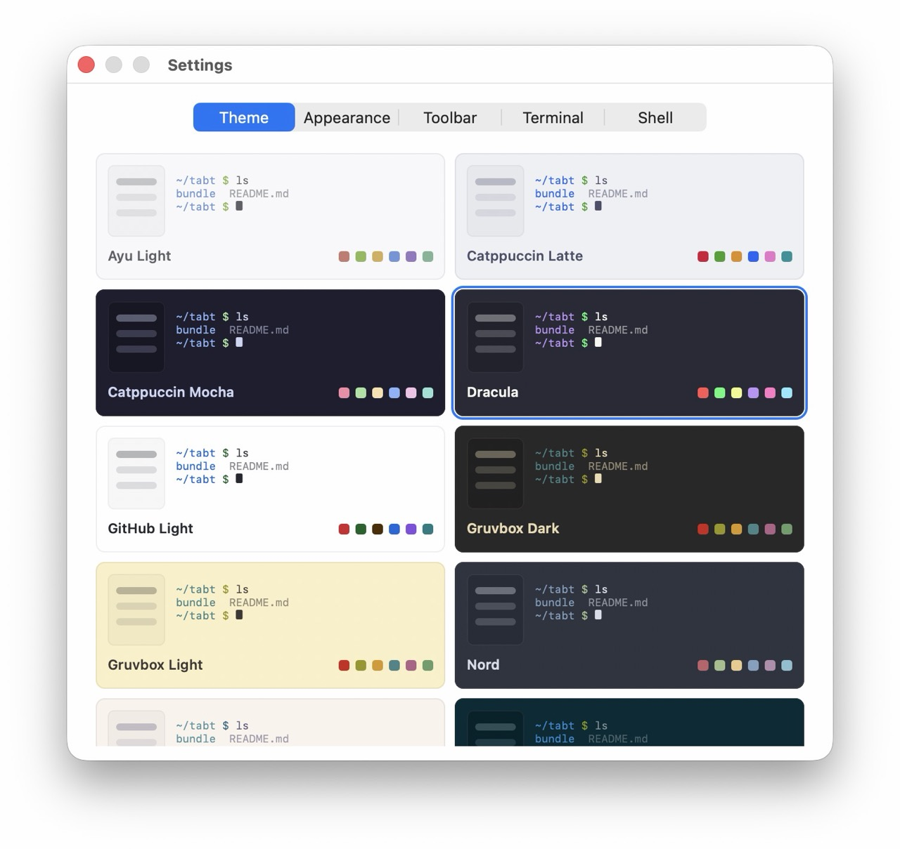

# TabT

A small, fast native terminal emulator for macOS — Rust on AppKit, multi-tab sessions in a
self-drawn sidebar, and a dependency-free VT/ANSI core. macOS 12 or later.




## Features

- **Tabs & groups** — one PTY per tab (⌘T), organized into named collapsible groups, dragged to
  reorder. ⌘F filters the list; double-click a name to rename it.
- **Live session state** — each row's icon shows running / at a prompt / exited, and marks a
  background tab that printed something unseen or rang the bell. Click an icon to color the row.
- **Themes** — 12 built-in, six dark and six light; the whole UI derives from the active one. Plain
  data, not code: edit `~/.tabt/themes.conf` to change one or add your own.
- **Settings** (⌘,) — *Theme* (a grid of live preview cards), *Appearance* (9 monospace fonts, size,
  sidebar side, padding, opacity), *Toolbar*, *Terminal* (cursor, blink, scrollback), *Shell*.
  Applied live, saved at once.
- **A toolbar you arrange by dragging it** — AI launchers (Claude and Codex out of the box; Gemini,
  Aider and Cursor in the palette) that type their command and press Return, plus session actions:
  clear, screenshot, export text, reveal in Finder, and more. The *Toolbar* settings pane is the
  toolbar itself, at full size: drag a button to reorder it, or out of its row to put it away.
- **Mouse support in TUIs** — clicks, drags and the wheel reported to vim/tmux/htop/lazygit in both
  the legacy and SGR encodings; hold ⇧ to select text instead.
- **VT/ANSI core** — SGR colors and attributes, cursor/scroll/erase, alternate screen, DEC private
  modes, IRM, tab stops, line-drawing charset, DSR/DA, OSC title and cwd, UTF-8, wide characters.
- **Persistence** — layout, groups, tabs, theme, font, window position and size restored on launch.
  A restored session's shell starts the first time you open that tab, so a twenty-tab layout costs
  one shell at launch rather than twenty.

## Install

Download `TabT-<version>.dmg` from the [latest release](https://github.com/hex2null/TabT/releases/latest)
and drag TabT to Applications.

The image is **not** notarized, so Gatekeeper refuses it on first launch: right-click the app and
choose *Open* (or `xattr -dr com.apple.quarantine /Applications/TabT.app`) once. Building it
yourself avoids that.

## Build & run

Requires macOS and a Rust toolchain (`rustup.rs`).

```sh
git clone https://github.com/hex2null/TabT.git tabt && cd tabt
make run     # build, bundle into dist/TabT Dev.app, code-sign, launch
```

## Keyboard shortcuts

| Shortcut | Action | | Shortcut | Action |
|---|---|---|---|---|
| ⌘T | New terminal | | ⌘F | Search sessions |
| ⇧⌘N | New group | | ⌘B | Toggle sidebar |
| ⌘W | Close tab | | ⌘K | Clear screen |
| ⌘R | Rename session | | ⌘= / ⌘- / ⌘0 | Font size ± / reset |
| ⌘, | Settings | | ⌘C / ⌘V / ⌘A | Copy / paste / select all |
| ⇧⌘R | Reveal cwd in Finder | | ⌃↩ | Session context menu |
| ⇧⌘S | Export session text | | ⌘` | Last session |

Also: double-click the header to zoom the window, double-click a tab/group name to rename it, click
a session's icon to set its color.

## Development

A two-crate Cargo workspace: `tabt-core` (the VT/ANSI engine — pure logic, zero dependencies, tests
on any platform) and `tabt-app` (the AppKit layer via `objc2`, macOS-only).

```sh
make test    # tabt-core unit tests, then tabt-app's (themes.conf parser, layout.conf round trip)
make release # the shipping identity, dist/TabT.app
make dmg     # package dist/TabT-<version>.dmg
make echo    # standalone PTY echo loop, a debugging tool; run in a real terminal, not an IDE panel
make bloat   # binary size audit (needs `cargo install cargo-bloat`)
make clean   # remove build artifacts
```

Three things to know before changing code:

- `tabt-app` must run as a `.app` bundle (`make run`) — a bare binary gets no focus or menu bar,
  which is normal macOS behavior for unbundled processes.
- The release profile is size-tuned (`opt-level="z"`, `lto`, `panic="abort"`, `strip`), so a panic
  anywhere kills the process — relevant to any code parsing PTY output or user input.
- `objc2`/`objc2-foundation`/`objc2-app-kit` are pinned to a matched set. If a type or method fails
  to resolve, check `cargo tree | grep objc2` and the `objc2-app-kit` feature list in
  `tabt-app/Cargo.toml` (one feature per Objective-C class).

`CLAUDE.md` is the long-form architecture guide.

## License

MIT — see [LICENSE](LICENSE).
